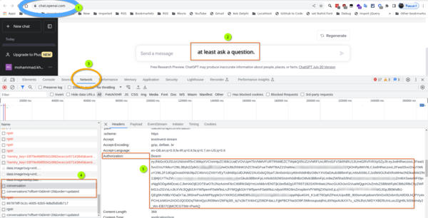

# Free Chatbot API

This project implements a Python web API that offers free access to three leading AI chatbots **ChatGPT**, **Google Bard**, and **Claude** through a single interface.

**Key features:**

-   Unified API endpoints allow seamlessly querying ChatGPT, Google Bard, and Claude from one integration.
-   Leverages the free web/browser versions of each AI service by managing cookies and sessions. Avoid costs of paid API access.
-   Simple API for text completion, question answering, and conversational queries. Integrate AI capabilities easily.
-   Lightweight Python server using FastAPI. Easily self-host locally or on your own infrastructure.
-   Full support for streaming responses.

<br>

-   ✅ **_Google Bard_** integration available now.
-   ✅ **_Claude-2_** integration is also fully implemented and available.
-   ✅ **_ChatGPT_** integration is fully complete and available now.

<br>

[](assets/Endpoints-Docs.png)

<br>

## Upcoming Tasks

-   Implement OpenAI endpoints for ChatGPT.
    - The beta endpoint of `v1/chat/completions` is available now ⏳
    
    <br>

-   Authorization is accomplished by logging into [cloud.ai](https://claude.ai/) or [bard.google.com](https://bard.google.com/) using a web browser, without requiring manual cookie configuration.
    - Done ✅

<br><br>

**NOTE:** It's a personal project to use tools like [ShellGPT](https://github.com/TheR1D/shell_gpt) and others.<br>

<br>

## Usage

#### How to Find Your Tokens

First you need to add your tokens to the **`Config.conf`** file (see **[Configuration](#configuration)** section).

<br>

**Note**: For Claude, all you need to do is [login](https://claude.ai/) to your account using your web browser. Alternatively, you can follow the instructions below.

<br>

<details>

  <summary>

**Google Bard**

  </summary>

[](assets/Bard.jpg)

_`Google Bard:`_ Please obtain the cookies mentioned here from an authorized session on bard.google.com. The cookies can be used to
send POST requests to the /bard endpoint along with a message in a JSON payload. It is important that the **session_id**,
which is your **Secure-1PSID** cookie, is included in the request. ([Screenshot](assets/Bard.jpg))

1. Login to [bard.google.com](https://bard.google.com)
2. Open `Developer Tools` (Press **F12**)
3. Go to `Application Tab`
4. Go to `Cookies Tab`
5. Copy the content of `__Secure-1PSID`
6. Set in **[Config.conf](#configuration)** file.
 </details>
 <br><hr><br>

<details>

  <summary>

**Claude 2**

  </summary>

[](assets/Claude.jpg)

**Method 1:** <br>
For Claude, all you need to do is [login](https://claude.ai/) to your account using your web browser. (Firefox, Chrome, Safari)

**Method 2:** <br>
_`Claude:`_ You can get cookie from the browser's developer tools network tab ( see for any [claude.ai](https://claude.ai/) requests check out cookie ,copy whole value ) or storage tab ( You can find cookie of claude.ai ,there will be four values ) ([Screenshot](assets/Claude.jpg))

1. Login to [claude.ai](https://claude.ai/)
2. Open `Developer Tools` (Press **F12**)
3. Go to `Network Tab`
4. Select an ajax request (like step 3 in [picture](assets/Claude.jpg))
5. Copy the content of `Cookie`
6. Set in **[Config.conf](#configuration)** file.

</details>

<br><hr><br>

<details>

  <summary>

**ChatGPT**

  </summary>

[](assets/ChatGPT.jpg)

_`ChatGPT:`_ Please obtain the sessions mentioned here from an authorized session on chat.openai.com. The sessions can be used to
send POST requests to the /chatgpt endpoint along with a message in a JSON payload. It is important that the session_id,
which is your `Authorization` header session, is included in the request. ([Screenshot](assets/ChatGPT.jpg))

1. Login to [chat.openai.com](https://chat.openai.com)
2. at least ask any question.
3. Open `Developer Tools` (Press **F12**)
4. Go to `Network Tab`
5. Select an ajax request (like step 4 in [picture](assets/ChatGPT.jpg))
6. Copy the content of `Authorization`
7. Set in **[Config.conf](#configuration)** file.

</details>

<br><hr>

### Prerequisites

(NOTE: This guide is still in progress.)

Before using the APIs, sign up for free accounts to get access credentials if you don't already have them:

-   ChatGPT: https://openai.com/api/
-   Google Bard: https://bard.google.com/
-   Claude: https://claude.ai/

Then, add your token(s) to the **`Config.conf`** file. (see **[Configuration](#configuration)** section).

<br>

## Installation

<br>

### Step 1. Clone Repository

```
git clone https://github.com/Amm1rr/Free-Chatbot-API.git && cd Free-Chatbot-API

python -m venv .venv

source .venv/bin/activate  # Linux or macOS
.venv\Scripts\activate  # Windows


pip install -r requirements.txt
```

<br>

### Step 2. Start Web Server

Navigate into the **`src`** directory, and run the web server using one of the methods below:

```
cd src/

python main.py

```

<br>

Available **Endpoints:**

```
---------- Google Bard

http://128.0.0.1:8000/bard


---------- Claude

http://128.0.0.1:8000/claude


---------- ChatGPT

http://128.0.0.1:8000/chatgpt

```

**Input / Output**

```
Input:
_____

    {
      "session_id": "your-session-id",
      "message": "Hi, Who are you?",
      "stream": True
    }

--------------------
--------------------

Output:
_____

    {
      I'm a Chatbot assistant :)
    }

```

<br>

## Example

try **Claude** with **cURL**

Once you have launched the webserver using **[`uvicorn main:app --reload --port 8000`](#step-2-start-web-server)** , run this cURL command in a terminal window:

```
curl -X 'POST' \
  'http://localhost:8000/claude' \
  -H 'accept: application/json' \
  -H 'Content-Type: application/json' \
  -d '{
  "message": "who are you?",
  "session_id": "",
  "stream": true
}'

```

**Note**: The **`session_id`** is configured in the **[Config.conf](#configuration)** file. If you send this variable empty, it will use the Config.conf

<br><br>

## Configuration

[How to Find Your Tokens](#usage)

**Note**: Claude and Bard presents two authentication options - logging in through your browser or configuring Claude using the provided config file.

#### Config File Path:

-   Free-Chatbot-API\src\Config.conf

```Config.conf
# Case-Sensative

[Claude]
COOKIE=[YOURS]

[ChatGPT]
ACCESS_TOKEN=[YOURS]

[Bard]
SESSION_ID=[YOURS]

```

<br>

## Sources

[Google Bard API](https://github.com/ra83205/google-bard-api) | [Claude API](https://github.com/KoushikNavuluri/Claude-API) | [revChatGPT](https://github.com/acheong08/ChatGPT/)

<br>

## Licensing

This project is licensed under the MIT License. Feel free to use it however you like.

<br>

[](https://github.com/Amm1rr/)
