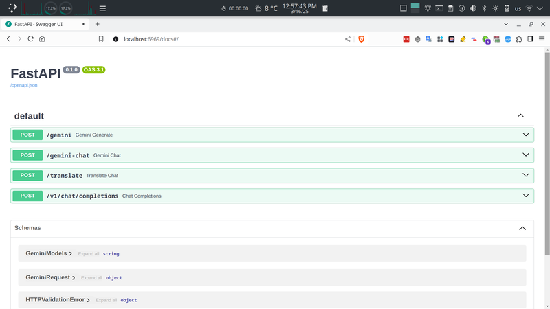

**NOTE:** This is a research project. Please do not use it commercially and use it responsibly.

<hr>

# WebAI to API

This project implements a web API that offers a unified interface to Google Gemini, and Claude 3.

[](assets/WebAI-Configuration.jpg)

### Key Features

- **Self-hosted:** Python/FastAPI enables flexibility to run anywhere. Not locked into proprietary platforms.

- **Streaming support:** Real-time responses from Claude and Gemini streaming.

- **Lightweight and scalable:** Built with FastAPI for high performance.

- **API Key:** No API Key required.

### Status

✅ **_Claude-3_** API integration is also fully implemented and available

✅ **_Google Gemini_** API integration available now

✅ ~**_ChatGPT_** API integration is fully complete and available now.~ (Temporarily Suspended)

✅ **_UI Configuration_**: Implement routing for [localhost:8000/WebAI](http://localhost:8000/WebAI) path (still in development)

<br>

[](assets/Endpoints-Docs.png)

<br>

This repository is up-to-date.<br>
Please don't forget to give a Star ⭐

<br><br>

<hr>

### Prerequisites

Python version >= 3.10
Accounts on the following (all offer free signups):

- Google Gemini: https://gemini.google.com/
- Claude: https://claude.ai/

Then, add your token(s) to the [**`Config.conf`**](#configuration) file. (see [**Configuration**](#configuration) section).

<br>
> [!NOTE]
> 
> **Note**: [**Claude**](https://claude.ai/) and [**Gemini**](https://gemini.google.com/) offer Auto Login options - you can either log in through your browser and skip this step.

<br>

## Installation

<br>

### Step 1. Clone Repository

```bash
git clone https://github.com/Amm1rr/WebAI-to-API.git && cd WebAI-to-API

python -m venv .venv

source .venv/bin/activate  # Linux/macOS
.venv\Scripts\activate     # Windows


pip install -r requirements.txt
```

<br>

### Step 2. Start Web Server

Navigate into the **`src`** directory, and run the web server:

```bash
cd src/

python main.py

```

<br>

Now the **API documentation** and **Configuration Web UI** should be available at the following addresses:

> [!TIP]
>
> #### Open Web UI Configuration: [http://localhost:8000/WebAI](http://localhost:8000/WebAI)
>
> #### Open API documentation: [http://localhost:8000/docs](http://localhost:8000/docs)

<br>

## Web UI Development Environment Setup

#### Prerequisites:

- [Node.js](http://nodejs.org): Download and install from the official website (https://nodejs.org)

First , **Navigate to the UI directory:**

```bash
cd WebAI-to-API/src/UI
```

2. **Install dependencies:**

```bash
npm install
```

3. **Build the project:**

```bash
npm run build
```

<br>

Available **Endpoints:**

```bash
#---------- Google Gemini

http://localhost:8000/gemini


#---------- Claude

http://localhost:8000/claude


#---------- Claude or Gemini

http://localhost:8000/v1/chat/completions

```

<br><br>

**Input / Output**

```bash
# Input:
_____

    {
      "message": "Hi, Who are you?",
      "stream": true
    }


--------------------


# Output:
_____

    {
      I am a Chatbot assistant :)
    }


--------------------


# Response Output:
_____

# Streaming
  "String"


# Not Streaming
  "String"


```

<br>
<hr>

## Example

Once you have launched the web server using [`python src\main.py`](#step-2-start-web-server):

> [!NOTE]
>
> Note: The first argument to run the example determines whether to return streaming or not.

```bash
cd examples/


python src/test.py

OR

python example_claude.py false
python example_claude.py true

python example_gemini.py false
python example_gemini.py true


```

or try **Claude** with **cURL**

run this cURL command in a terminal window:

```bash
curl -X 'POST' \
  'http://localhost:8000/claude' \
  -H 'accept: application/json' \
  -H 'Content-Type: application/json' \
  -d '{
  "message": "who are you?",
  "stream": false
}'

```

<br>

> [!NOTE]
>
> **Note**: The **`session_id`** is configured in the [**Config.conf**](#configuration) file. If you send this variable empty, it will use the [Config.conf](#configuration)

<br>

<hr>

## Usage

#### How to find tokens

> [!NOTE]
>
> **Note**: [**Claude**](https://claude.ai/) and [**Gemini**](https://gemini.google.com/) offer two authentication options - you can either log in through your browser and skip this step, or you can follow the instructions below to configure the authentication.

> [!IMPORTANT]
>
> "The auto login by browser issue is caused by using multiple accounts or browser profiles. It will take some time to fully resolve. A future update will address it. For now, if you have problems logging in with your browsers, try logging in with just one browser or manually copy sessions and cookies as a workaround, as described in the instructions below."

<br>

First you need to add your tokens to the [**`Config.conf`**](#configuration) file (see [**Configuration**](#configuration) section).

<br>

<details>

  <summary>

#### Gemini

  </summary>

[](assets/Bard.jpg)

**Method 1:** <br>
For Gemini, all you need to do is [login](https://gemini.google.com/) to your account using your web browser. (Firefox, Chrome, Safari, Edge...)

**Method 2:** <br>
_`Google Gemini:`_ Please obtain the cookies mentioned here from an authorized session on gemini.google.com. The cookies can be used to send POST requests to the /gemini endpoint along with a message in a JSON payload. It is important that the **session_id**, which is your **\_\_Secure-1PSID** cookie, and the **session_idts** and **session_idcc**, which is your **Secure-1PSIDTS** and **Secure-1PSIDCC** cookie, are included in the request. ([Screenshot](assets/Bard.jpg))
<br>

| Name           | Session Name       |
| -------------- | ------------------ |
| `session_id`   | `__Secure-1PSID`   |
| `session_idts` | `__Secure-1PSIDTS` |
| `session_idcc` | `__Secure-1PSIDCC` |

1. Login to [gemini.google.com](https://gemini.google.com)
2. Open `Developer Tools` (Press **F12**)
3. Go to `Application Tab`
4. Go to `Cookies Tab`
5. Copy the content of `__Secure-1PSID` and `__Secure-1PSIDTS` and `__Secure-1PSIDCC`. Copy the value of those cookie.
6. Set in **[Config.conf](#configuration)** file.
</details>
<br><hr><br>

<details>

  <summary>

#### Claude

  </summary>

[](assets/Claude.jpg)

**Method 1:** <br>
For Claude, all you need to do is [login](https://claude.ai/) to your account using your web browser. (Firefox, Chrome, Safari, Edge...)

**Method 2:** <br>
_`Claude:`_ You can get cookie from the browser's developer tools network tab ( see for any [claude.ai](https://claude.ai/) requests check out cookie ,copy whole value ) or storage tab ( You can find cookie of claude.ai ,there will be four values ) ([Screenshot](assets/Claude.jpg))

1. Login to [claude.ai](https://claude.ai/)
2. Open `Developer Tools` (Press **F12**)
3. Go to `Network Tab`
4. Select an ajax request (like step 3 in [picture](assets/Claude.jpg))
5. Copy the content of `Cookie`
6. Set in **[Config.conf](#configuration)** file.

</details>

<br>

## Configuration

- Open Web UI Panel: **[http://localhost:8000/WebAI](http://localhost:8000/WebAI)**

<br>

How to [find tokens](#usage)

- [Google Gemini](#gemini)
- [Claude](#claude)

> [!NOTE]
>
> **Note**: Claude and Gemini present Auto Login options - logging in through your browser or configuring Claude and Gemini using the provided config file.

<br>

### Configuring the Model Type for `/v1/chat/completions`

You can specify the model type in the settings for the `/v1/chat/completions` endpoint. The available options are "Claude" and "Gemini".
By default, the system uses the "Claude" model.

```bash
# Case-Sensative

[Main]
Model=Claude
#Model=Gemini
```

<br>

#### Config File Path:

- WebAI-to-API\src\Config.conf

```bash
# Case-Sensative

[Claude]
COOKIE=[YOURS]

[Gemini]
SESSION_ID=[YOURS]
SESSION_IDTS=[YOURS]
SESSION_IDCC=[YOURS]

```

<br>

## Licensing

This project is licensed under the MIT License. Feel free to use it however you like.

<br>

[](https://github.com/Amm1rr/)
