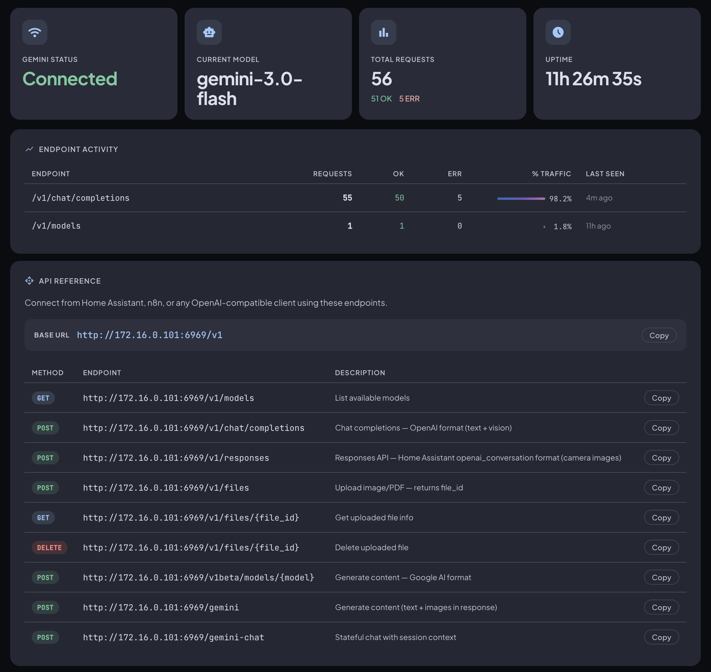

> **This project is intended for research and educational purposes only.**
> Please use it responsibly and refrain from any commercial use.

# WebAI-to-API

A FastAPI server that exposes Google Gemini (via browser cookies) as a local OpenAI-compatible API endpoint. No API key required — it reuses your existing browser session.

Compatible with any tool that supports the OpenAI API format: [Open WebUI](https://github.com/open-webui/open-webui), [Cursor](https://cursor.sh), [Continue](https://continue.dev), custom scripts, etc.



---

## Deploy with Docker Compose

### 1. Create a folder and add two files

**`docker-compose.yml`**

```yaml
services:
  web_ai:
    image: ghcr.io/leolionart/webai-to-api:latest
    container_name: web_ai_server
    restart: always
    ports:
      - "6969:6969"
    environment:
      - PYTHONPATH=/app/src
      - CONFIG_PATH=/app/data/config.conf
    volumes:
      - ./config.conf:/app/data/config.conf
    command: uvicorn app.main:app --host 0.0.0.0 --port 6969 --workers 1 --log-level info
```

**`config.conf`** (leave cookies empty for now)

```ini
[Browser]
name = chrome

[AI]
default_ai = gemini
default_model_gemini = gemini-3.0-flash

[Cookies]
gemini_cookie_1psid   =
gemini_cookie_1psidts =

[EnabledAI]
gemini = true

[Proxy]
http_proxy =
```

### 2. Start the server

```bash
docker compose up -d
```

### 3. Open the admin dashboard

Go to **`http://localhost:6969/admin`**

From there, paste your Gemini cookies and click **Connect** — no file editing needed.

---

## Getting Gemini cookies

1. Open [gemini.google.com](https://gemini.google.com) and log in
2. Open DevTools (`F12`) → **Network** tab → refresh the page → click any request to `gemini.google.com`
3. Right-click the request → **Copy → Copy as cURL**
4. Paste the cURL command into the admin dashboard — it extracts the cookies automatically

Or manually: DevTools → **Application** → **Cookies** → copy `__Secure-1PSID` and `__Secure-1PSIDTS`.

Cookies are saved to `config.conf` in your folder and auto-rotated in the background — no manual refresh needed.

---

## Using the API

The server exposes an OpenAI-compatible endpoint. Point any compatible tool to:

```
Base URL: http://localhost:6969/v1
API Key:  not-needed
```

### Supported models

| Model                         | Description                             |
| ----------------------------- | --------------------------------------- |
| `gemini-3.0-pro`            | Most capable (requires Gemini Advanced) |
| `gemini-3.0-flash`          | Fast, efficient (default)               |
| `gemini-3.0-flash-thinking` | Extended thinking                       |

### Example: curl

```bash
curl http://localhost:6969/v1/chat/completions \
  -H "Content-Type: application/json" \
  -d '{
    "model": "gemini-3.0-flash",
    "messages": [{ "role": "user", "content": "Hello!" }]
  }'
```

### Example: OpenAI Python client

```python
from openai import OpenAI

client = OpenAI(
    base_url="http://localhost:6969/v1",
    api_key="not-needed",
)

response = client.chat.completions.create(
    model="gemini-3.0-flash",
    messages=[{"role": "user", "content": "Hello!"}],
)
print(response.choices[0].message.content)
```

---

## Endpoints

| Method   | Path                     | Description                                  |
| -------- | ------------------------ | -------------------------------------------- |
| `GET`  | `/v1/models`           | List available models                        |
| `POST` | `/v1/chat/completions` | OpenAI-compatible chat (streaming supported) |
| `POST` | `/gemini`              | Stateless single-turn request                |
| `POST` | `/gemini-chat`         | Stateful multi-turn chat                     |
| `POST` | `/translate`           | Translation (alias for `/gemini-chat`)     |
| `GET`  | `/admin`               | Admin dashboard                              |
| `GET`  | `/docs`                | Swagger UI                                   |

---

## Common commands

```bash
docker compose up -d          # start
docker compose down           # stop
docker compose logs -f        # live logs
docker compose pull && docker compose up -d   # update to latest
```

---

## Star History

[](https://www.star-history.com/#Amm1rr/WebAI-to-API&Date)

## License

[MIT License](LICENSE)
