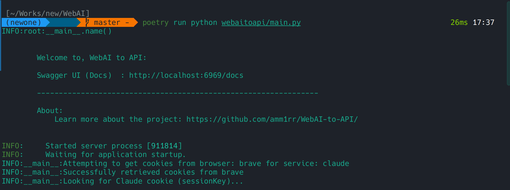
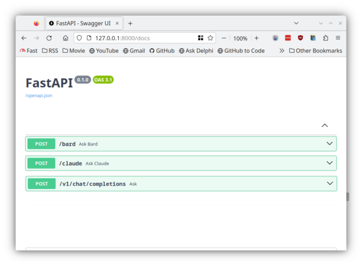

## Disclaimer

**This is a research project. Please do not use it commercially and use it responsibly.**

<hr>

# WebAI-to-API



WebAI-to-API is a modular web server built with FastAPI, designed to manage requests across AI services like Gemini and Claude. It supports configurable setups and streamlined integration. Please note:

- Currently, **Gemini** is functional.
- **Claude** is under development and will be supported soon.

---

## Features

- 🌐 **Endpoints Management**:
  - `/v1/chat/completions` (Unified, routes to default or specified model)
  - `/gemini` (Direct to Gemini)
  - `/claude` (Direct to Claude - *under development*)
  - `/deepseek` (Direct to DeepSeek - *experimental, not operational*)
- 🔄 **Service Switching**: Configure Gemini, Claude, and DeepSeek in `config.conf`. Note that Claude and DeepSeek are not fully operational yet.
- 🛠️ **Modular Architecture**: Easy to extend and maintain.

[](assets/Endpoints-Docs.png)

---

## Installation

1. Clone the repository:

   ```bash
   git clone https://github.com/Amm1rr/WebAI-to-API.git
   cd WebAI-to-API
   ```

2. Install dependencies using Poetry:

   ```bash
   poetry install
   ```

3. Create a configuration file:

   ```bash
   cp webaitoapi/config.conf.example webaitoapi/config.conf
   ```

4. Edit `webaitoapi/config.conf` to set up your desired service settings.

5. Run the server:
   ```bash
   poetry run python webaitoapi/main.py
   ```

---

## API Endpoints

This section details the available API endpoints, their functionalities, and how to use them.

### 1. `/v1/chat/completions`

This is the primary endpoint for interacting with the configured AI models. It acts as a unified interface, routing requests to the appropriate backend service (e.g., Gemini) based on the `model` field in the request body or the `default_ai` setting in `config.conf`.

**Functionality:**
- Receives a chat request with user messages.
- Forwards the request to the specified or default AI model.
- Returns a standardized chat completion response.

**Request Parameters:**

- `model` (string, optional): Specifies the AI model to use (e.g., `"gemini"`, `"claude"`). If omitted, the `default_ai` from `config.conf` will be used.
- `messages` (array of objects, required): A list of message objects, where each object has:
    - `role` (string, required): The role of the message sender (e.g., `"user"`, `"assistant"`).
    - `content` (string, required): The content of the message.

**Example Request Body:**
```json
{
  "model": "gemini",
  "messages": [
    {
      "role": "user",
      "content": "Hello! Can you tell me a joke?"
    }
  ]
}
```
If you want to use the default AI model specified in `config.conf`, you can omit the `model` field:
```json
{
  "messages": [
    {
      "role": "user",
      "content": "What is the capital of France?"
    }
  ]
}
```

**Response Structure:**

The response aims to be compatible with the OpenAI ChatCompletion format.

- `id` (string): A unique identifier for the chat completion.
- `object` (string): The type of object, typically `"chat.completion"`.
- `created` (integer): A Unix timestamp representing when the completion was created.
- `model` (string): The model that generated the response.
- `choices` (array of objects): A list of completion choices. Usually, there's one choice.
    - `message` (object): The message generated by the AI.
        - `role` (string): The role of the sender (always `"assistant"`).
        - `content` (string): The content of the AI's response.
    - `finish_reason` (string): The reason the model stopped generating tokens (e.g., `"stop"`).
    - `index` (integer): The index of the choice in the list.

**Example Response Body:**

```json
{
  "model": "gemini",
  "messages": [{ "role": "user", "content": "Hello!" }]
}
```

```json
{
  "id": "chatcmpl-abcdef12345",
  "object": "chat.completion",
  "created": 1693417200,
  "model": "gemini",
  "choices": [
    {
      "index": 0,
      "message": {
        "role": "assistant",
        "content": "Why don't scientists trust atoms? Because they make up everything!"
      },
      "finish_reason": "stop"
    }
  ]
}
```

**Specific Behaviors/Limitations:**
- If the specified `model` in the request is not enabled in `config.conf` or not supported, an error will be returned.
- Cookie-based authentication for services like Gemini (if not using an API key) is handled automatically based on `config.conf` settings. Ensure cookies are valid.

### 2. `/gemini`

This endpoint routes requests directly to the Gemini model. It bypasses the `model` selection field and is intended for direct interaction with Gemini if it's the desired service.

**Functionality:**
- Receives a chat request with user messages specifically for Gemini.
- Forwards the request to the Gemini backend.
- Returns a chat completion response from Gemini.

**Request Parameters:**

- `messages` (array of objects, required): A list of message objects, where each object has:
    - `role` (string, required): The role of the message sender (e.g., `"user"`, `"assistant"`).
    - `content` (string, required): The content of the message.
- **Note**: The `model` parameter is not used here as the endpoint itself specifies the service.

**Example Request Body:**
```json
{
  "messages": [
    {
      "role": "user",
      "content": "What are some interesting facts about the Gemini space program?"
    }
  ]
}
```

**Response Structure:**

The response structure is identical to that of `/v1/chat/completions`.

**Example Response Body:**
```json
{
  "id": "chatcmpl-gemini123",
  "object": "chat.completion",
  "created": 1693417201,
  "model": "gemini",
  "choices": [
    {
      "index": 0,
      "message": {
        "role": "assistant",
        "content": "The Gemini program was NASA's second human spaceflight program, conducted between 1961 and 1966. It was a bridge between the Mercury and Apollo programs, testing technologies and procedures for lunar missions."
      },
      "finish_reason": "stop"
    }
  ]
}
```

**Specific Behaviors/Limitations:**
- This endpoint will only work if Gemini is enabled and properly configured in `config.conf`.
- Cookie-based authentication is handled as per `config.conf`.

### 3. `/claude`

This endpoint is intended to route requests directly to the Claude model.

**Functionality:**
- Receives a chat request with user messages specifically for Claude.
- Forwards the request to the Claude backend.
- Returns a chat completion response from Claude.

**Current Status: Under Development**
- As noted in the "Roadmap", Claude integration is currently in progress. This endpoint may not be fully functional or may be subject to change.
- The request and response structures are expected to be similar to `/v1/chat/completions`.

**Request Parameters (Anticipated):**

- `messages` (array of objects, required): Similar to other endpoints. Each object should have:
    - `role` (string, required): `"user"` or `"assistant"`.
    - `content` (string, required): Message content.

**Example Request Body (Anticipated):**
```json
{
  "messages": [
    {
      "role": "user",
      "content": "What are the core principles of constitutional AI?"
    }
  ]
}
```

**Response Structure (Anticipated):**

Similar to `/v1/chat/completions`.

**Example Response Body (Anticipated):**
```json
{
  "id": "chatcmpl-claude123",
  "object": "chat.completion",
  "created": 1693417202,
  "model": "claude",
  "choices": [
    {
      "index": 0,
      "message": {
        "role": "assistant",
        "content": "Constitutional AI refers to a set of principles or a 'constitution' that guides an AI's behavior, ensuring it remains helpful, harmless, and honest. These principles are often instilled during the AI's training process."
      },
      "finish_reason": "stop"
    }
  ]
}
```

**Specific Behaviors/Limitations:**
- This endpoint will only work if Claude is enabled and properly configured in `config.conf` once development is complete.
- Authentication and specific model parameters will depend on the final implementation.

### 4. `/deepseek`

This endpoint is intended for interaction with the DeepSeek model.

**Functionality:**
- Routes requests to the DeepSeek model.

**Current Status: Experimental & Not Yet Operational**
- As noted in the "Roadmap", DeepSeek integration is experimental and not currently functional.
- This endpoint is reserved for future development. Users should not expect it to work at this time.

**Request Parameters (Tentative):**
- Likely to be similar to other chat completion endpoints. It would typically require a `messages` array, where each message object has a `role` and `content`.
    - `messages` (array of objects):
        - `role` (string): `"user"` or `"assistant"`.
        - `content` (string): Message content.

**Example Request Body (Tentative):**
```json
{
  "messages": [
    {
      "role": "user",
      "content": "What is DeepSeek Coder and what are its capabilities?"
    }
  ]
}
```

**Response Structure (Tentative):**
- Expected to be similar to `/v1/chat/completions`.

**Example Response Body (Tentative):**
```json
{
  "id": "chatcmpl-deepseek123",
  "object": "chat.completion",
  "created": 1693417203,
  "model": "deepseek",
  "choices": [
    {
      "index": 0,
      "message": {
        "role": "assistant",
        "content": "DeepSeek Coder is a family of code language models trained from scratch on a large dataset of code and natural language. It aims to provide strong code generation and completion capabilities."
      },
      "finish_reason": "stop"
    }
  ]
}
```

**Specific Behaviors/Limitations:**
- This endpoint is **not active**.
- Configuration for DeepSeek (e.g., API key `user_token`) can be found in `webaitoapi/config.conf.example` and should be set in `webaitoapi/config.conf` for when this model becomes operational.

---

<details>

  <summary>

## Project Structure

  </summary>

```plaintext
.
├── assets
│   └── (Screenshots)
├── LICENSE
├── poetry.lock
├── Prompt.txt
├── pyproject.toml
├── README.md
└── webaitoapi
    ├── config.conf.example
    ├── __init__.py
    ├── main.py
    └── models
        ├── claude.py
        ├── deepseek.py
        └── gemini.py
```

</details>

---

## Roadmap

- ✅ **Gemini**: Fully functional and supported via `/v1/chat/completions` and `/gemini`.
- 🟡 **Claude**: Under active development. The `/claude` endpoint is reserved. Basic configuration is available, but the integration is not yet complete or stable. Users should not expect reliable functionality for Claude at this time.
- 🔬 **DeepSeek**: Experimental and not currently operational. The `/deepseek` endpoint is reserved for future implementation. Configuration options are present in `config.conf.example` for forward compatibility, but the model is not usable through the API.

---

<details>
  <summary>
    <h2>Configuration ⚙️</h2>
  </summary>

**Note on Configuration File Updates:**
If `config.conf` is missing certain sections or keys upon first run (e.g., the `[Browser]` section, default AI models, or enabled status for AIs), the application will attempt to create them with default values and write them back to `config.conf`. This is done to ensure the application can start with a basic configuration. However, if you have a custom setup or specific needs, it's recommended to review `config.conf` after the server's first startup to ensure the settings align with your requirements and make any necessary adjustments.

### Key Configuration Options

| Section     | Option                   | Description                   | Example Value |
| ----------- | ------------------------ | ----------------------------- | ------------- |
| [AI]        | default_ai               | /v1/chat/completions          | `gemini`      |
| [EnabledAI] | gemini, claude, deepseek | Enable/disable provider       | `true`        |
| [Browser]   | name                     | Browser for cookie-based auth | `firefox`     |

The full configuration template is available in [`config.conf.example`](webaitoapi/config.conf.example).  
 Leave the cookies field empty to use `browser_cookies3` and the default browser selected in the config file for automatic authentication.

---

  <details>
    <summary>
      <h3>config.conf</h3>
    </summary>

    ```
    [AI]
    # Set the default AI service to be used.
    # Options: gemini, claude
    default_ai = gemini

    # Specify the default model for the Gemini AI service.
    # Available options:
    # "gemini-1.5-flash", "gemini-2.0-flash-exp", "gemini-1.5-pro"
    default_model_gemini = gemini-1.5-pro

    # Specify the default model for the Claude AI service.
    # Available options:
    # "claude-3-sonnet-20240229", "claude-3-5-sonnet-20241022", "claude-3-5-haiku-20241022"
    default_model_claude = claude-3-5-sonnet-20241022

    [Cookies]
    # Provide cookies required for the Claude AI service.
    claude_cookie =

    # Provide cookies required for the Gemini AI service.
    gemini_cookie_1psid =
    gemini_cookie_1psidts =

    [Deepseek]
    # Token for Deepseek AI service integration.
    user_token =

    [EnabledAI]
    # Enable or disable each AI service.
    # Use "true" to enable or "false" to disable.
    claude = false
    gemini = true
    deepseek = false

    [Browser]
    # Specify the default browser for any required operations.
    # Options: firefox, brave, chrome, edge, safari
    name = firefox
    ```

  </details>

### Automatic Browser Cookie Fetching

For services that rely on browser cookies for authentication (currently Gemini and Claude if their specific cookie fields in `config.conf` are left empty), this application includes a feature to attempt to automatically fetch these cookies from your installed web browsers.

**How it Works:**
- If a required cookie (e.g., `gemini_cookie_1psid`, `claude_cookie`) is not explicitly provided in the `[Cookies]` section of `config.conf`, the application will try to retrieve it from the browser specified in the `[Browser].name` setting (e.g., Firefox, Chrome, Brave, Edge, Safari).
- It uses the `browser-cookie3` library to access the cookie files stored by these browsers on the machine where the server is running.
- This is done during the server startup when initializing the AI clients.

**⚠️ Security Implications & Warnings:**
- **Accessing Browser Data:** This feature directly accesses local browser cookie storage. While it targets specific cookies for AI services, the underlying library might have broader access permissions to your browser's cookie database.
- **Sensitive Information:** Cookies, especially session cookies, are sensitive credentials. If compromised, they could potentially allow unauthorized access to your AI service accounts or other websites you are logged into.
- **Server Security is Crucial:** If the machine running this API server is compromised, attackers could potentially exploit this feature or access the fetched cookies.

**🔒 Best Practices for Cookie Management:**

1.  **Manual Configuration (Recommended for Security):**
    *   The most secure way to provide cookies is to manually copy them from your browser and paste them into the respective fields in `webaitoapi/config.conf` (e.g., `claude_cookie`, `gemini_cookie_1psid`, `gemini_cookie_1psidts`).
    *   This avoids granting the application direct access to your browser's cookie files.
    *   You can find instructions on how to access cookies in your browser's developer tools.

2.  **Dedicated Browser Profile:**
    *   If you choose to rely on automatic cookie fetching, consider using a dedicated browser profile exclusively for the AI services you intend to use with this API.
    *   Log in to the AI services (e.g., Gemini, Claude) only within this dedicated profile. This limits the cookies accessible by the application to only those related to these services.

3.  **Secure Your Server:**
    *   Ensure that the machine where the WebAI-to-API server is running is well-secured. This includes regular OS updates, firewall configurations, and limited access to the server itself.

4.  **Understand the Risk:**
    *   Be aware of the risks associated with allowing an application to access browser cookies. Only use this feature if you understand and accept these risks. If in doubt, opt for manual cookie configuration.

5.  **Review Configuration:**
    *   The `[Browser].name` field in `config.conf` determines which browser's cookies will be accessed. Ensure this is set correctly if you intend to use this feature.

By default, if cookie fields are empty in `config.conf`, the system will attempt to fetch them. To disable fetching for a specific service, ensure its cookie fields are either filled or the service itself is disabled under `[EnabledAI]`.

</details>

- Located at `webaitoapi/config.conf`.
- Switch between Gemini and Claude services.
- Example configuration is provided in `config.conf.example`.

---

## License 📜

This project is open source under the [MIT License](LICENSE).

---

> **Note**: This is a research project. Please use it responsibly and avoid commercial use. Additional security configuration and error handling are required for production use.

<br>

[](https://github.com/Amm1rr/)

---

## Testing

This project uses `pytest` for running unit and integration tests.

**Prerequisites:**
- Ensure you have installed the development dependencies:
  ```bash
  poetry install --with dev
  ```

**Running Tests:**
To run all tests, navigate to the project root directory and execute:
```bash
poetry run pytest
```
Or, if your virtual environment is already activated:
```bash
pytest
```

The tests are located in the `tests/` directory. Test files are named like `test_*.py`.
Currently, tests cover:
- Utility functions like `convert_to_openai_format`.
- Basic API endpoint functionality for non-streaming responses, including success cases and handling of disabled AI clients. Mocking is used to simulate AI client behavior.

Further tests, especially for streaming responses, may be added in the future.
