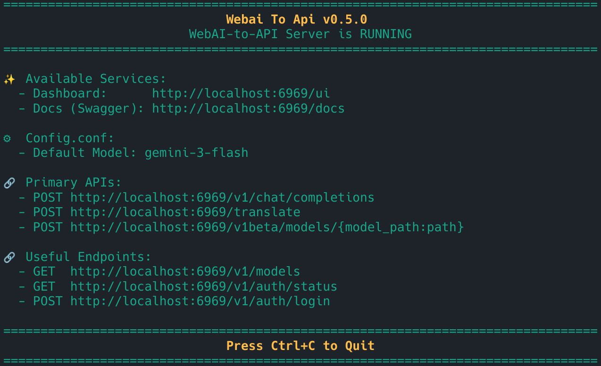
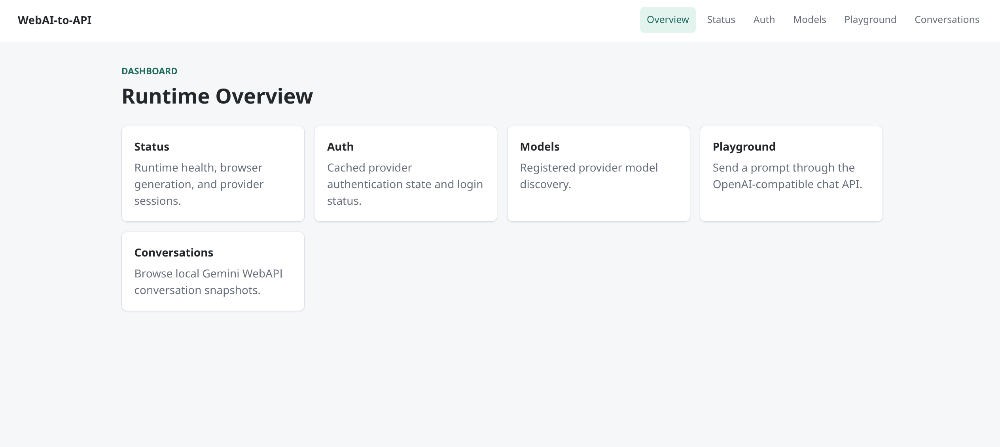

# WebAI-to-API

<p align="center">
  
  
  <a href="https://www.atlascloud.ai/?utm_source=github&utm_medium=link&utm_campaign=WebAI-to-API">
    
  </a>
</p>

**WebAI-to-API** is a browser-native AI runtime that exposes browser-based AI services through OpenAI-compatible APIs.

WebAI-to-API combines browser-native automation with WebAPI-based provider integrations to expose AI services through a flexible OpenAI-compatible API layer.

---

## Features

* OpenAI-compatible `/v1/chat/completions` API
* Provider-based architecture with unified routing
* Streaming response support (SSE)
* Conversation continuation support
* Health, readiness, and runtime diagnostics endpoints
* Docker deployment support
* Authentication management and browser login workflows

---

## Available Providers

### Gemini

Provides access to Google Gemini models through either the WebAPI backend or a browser-native Playwright runtime.

### Atlas Cloud

Provides access to cloud-hosted AI models through a native API integration powered by [Atlas Cloud](https://www.atlascloud.ai/?utm_source=github&utm_medium=link&utm_campaign=WebAI-to-API).

---

## Quick Start

### 1. Install Dependencies
```bash
poetry install
poetry run playwright install chromium
```

### 2. Configuration
```bash
cp config.conf.example config.conf
```
*For detailed settings (including logging verbosity and access log configurations), see [Configuration Guide](docs/configuration.md).*


### 3. Authenticate
```bash
python verify_login.py
```

### 4. Start the Server
```bash
poetry run python src/run.py
```

> [!TIP]
> New users can run `make setup` and `make doctor` for automated setup and diagnostics. See [Convenience Shortcuts](#optional-convenience-shortcuts) below.

---

## Optional: Convenience Shortcuts

WebAI-to-API includes a bootstrap utility and a Makefile for common setup tasks.

| Command | Description |
|---------|-------------|
| `make setup` | One-step install, directory creation, and config setup. |
| `make doctor` | Run environment and dependency diagnostics. |

*Alternative (no Make): `python scripts/bootstrap.py` and `python scripts/doctor.py`*

---

## Authentication

Gemini requires an authenticated Google session.

| Method | Recommended For |
|----------|----------|
| **Browser Login (`verify_login.py`)** | **Recommended.** Playwright backend, Docker, and long-term usage. |
| Manual Cookies | Quick testing and WebAPI-only usage. |

### 1. Browser Login (Recommended)
1. Run the interactive login helper:
   ```bash
   python verify_login.py
   ```
2. Complete the sign-in process in the browser window.
3. This creates `runtime/auth/gemini.json`, used by both backends.

### 2. Manual Cookies
1. Sign in to [Gemini](https://gemini.google.com/).
2. Copy `__Secure-1PSID` and `__Secure-1PSIDTS` from your browser cookies.
3. Paste them into the `[Gemini]` section of `config.conf`.

---

## Send Your First Request

```bash
curl -X POST http://localhost:6969/v1/chat/completions \
  -H "Content-Type: application/json" \
  -d '{
    "model": "gemini-3-flash",
    "messages": [
      {
        "role": "user",
        "content": "Hello!"
      }
    ]
  }'
```

---

## Dashboard

Open the dashboard at `http://localhost:6969/ui`.

The dashboard provides a visual interface for runtime status, authentication management, API discovery, and interactive testing.

### Available Endpoints

| Endpoint | Purpose |
| --- | --- |
| `/v1/chat/completions` | OpenAI-compatible chat completions |
| `/v1/temporary/chat/completions` | Gemini WebAPI temporary chat |
| `/v1/models` | List supported models |
| `/v1/auth/status` | Check authentication status |
| `/v1/auth/login` | Start authentication flow |
| `/v1/conversations` | Manage Gemini WebAPI conversation snapshots |
| `/translate` | Legacy translation compatibility |
| `/ui/*` | Dashboard and playground |

### Temporary Gemini Chat

`/v1/temporary/chat/completions` is Gemini WebAPI-only and uses Gemini temporary requests (`temporary=True`).
Requests are not stored in Gemini history and do not create SQLite conversation snapshots.
It supports streaming, non-streaming, multimodal file inputs, and artifact outputs. See [docs/api.md](docs/api.md) for details.

### Legacy Translate Endpoint

The `/translate` endpoint is maintained for compatibility with the [Translate It!](https://github.com/iSegaro/Translate-It/) browser extension.

It uses Gemini temporary requests and a shared in-memory session. See [docs/api.md](docs/api.md) for additional details.

### File Support

File input is supported through OpenAI-style `content` parts on `/v1/chat/completions` when routed to the Gemini WebAPI backend.
The currently verified file formats are documented in [docs/api.md](docs/api.md).

> [!NOTE]
> File parts are supported only by the Gemini WebAPI backend in the MVP. Gemini Playwright and Atlas reject file parts with a clear capability error.
> For Gemini WebAPI, text content parts are concatenated into one prompt and file parts are passed as attachments. Exact text/file interleaving order is not preserved.
> The built-in `/ui/playground` page uses the same contract for file attachments.

---

## Supported Models

Available models may vary depending on the configured provider and backend.

Use the `/v1/models` endpoint to retrieve the current list of supported models.

---

## Model Routing

WebAI-to-API uses model prefixes to route requests to specific backends.

| Model | Backend |
|---------|---------|
| `gemini-3-flash` | Gemini (default configured backend) |
| `playwright/gemini-3-flash` | Gemini Playwright |
| `atlas/<model-id>` | Atlas Cloud via OpenAI-compatible API, with 50 validated chat models exposed in `/v1/models` |

> [!TIP]
> Model prefixes force backend selection and override the default Gemini backend configured in `config.conf`. Use `playwright/...` model prefixes to force the Playwright backend explicitly.

---

## Documentation

- [API Documentation](docs/api.md)
- [Configuration Guide](docs/configuration.md)
- [Architecture Guide](docs/architecture.md)
- [Docker Deployment Guide](docs/docker.md)
- [Dashboard Guide](docs/dashboard.md)

Interactive API documentation is available through Swagger UI when the server is running.

---

## Star History

[](https://www.star-history.com/#Amm1rr/WebAI-to-API&Date)

---

## License

WebAI-to-API is licensed under the Apache License 2.0. See [LICENSE](LICENSE) for the full text.


<br>

[](https://github.com/Amm1rr/)
