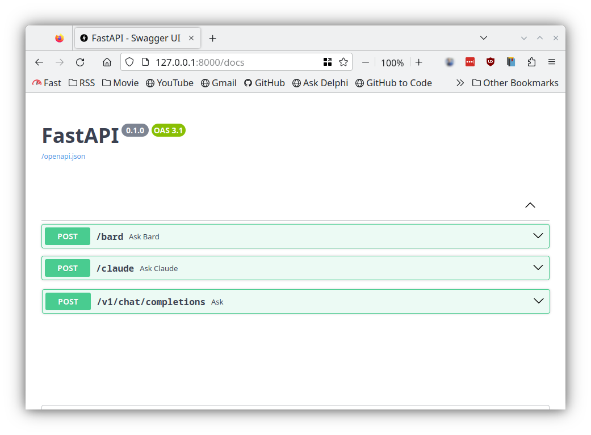

## Disclaimer

> **This project is intended for research and educational purposes only.**  
> Please refrain from any commercial use and act responsibly when deploying or modifying this tool.

---

# WebAI-to-API

<p align="center">
  
  <a href="https://www.atlascloud.ai/?utm_source=github&utm_medium=link&utm_campaign=WebAI-to-API">
    
  </a>
</p>

**WebAI-to-API** is a modular web server built with FastAPI that allows you to expose your preferred browser-based LLM (such as Gemini) as a local API endpoint.

---

This project supports **three operational modes**:

1. **Primary Web Server**

   > WebAI-to-API

   Connects to the Gemini web interface using your browser cookies and exposes it as an API endpoint. This method is lightweight, fast, and efficient for personal use.

2. **Atlas Cloud Provider**

   > [Atlas Cloud](https://www.atlascloud.ai/?utm_source=github&utm_medium=link&utm_campaign=WebAI-to-API)

   A direct API provider offering high-performance access to advanced models like MiniMax-M2. Ideal for developers seeking a reliable, low-latency cloud alternative with native OpenAI compatibility.

This design provides both **speed and reliability**, ensuring flexibility depending on your use case and available resources.

---

## Features

- 🌐 **Available Endpoints**:

  ### Primary APIs
  - `/v1/chat/completions` (OpenAI-compatible) — **Recommended**
  - `/v1/models` (List all available providers and models)

  ### Authentication APIs
  - `/v1/auth/status` (Check authentication state and login progress)
  - `/v1/auth/login` (Trigger browser-based login workflow)

  ### System & Health APIs
  - `/health` (Liveness probe for process health)
  - `/ready` (Readiness probe for structural runtime health)
  - `/v1/runtime/status` (Detailed runtime diagnostics and metrics)

  ### Compatibility APIs
  - `/v1beta/models/{model}` (Google Generative AI v1beta compatibility layer)

  ### Legacy / Specialized APIs
  - `/gemini` (Legacy stateless Gemini endpoint)
  - `/gemini-chat` (Legacy in-memory conversation endpoint — does not survive restarts)
  - `/translate` (Specialized endpoint for Translate It! integration)
  - `/v1/gems` (List available Gemini Gems)

- 🛠️ **Refactored Architecture**: Decoupled gateway logic with a lightweight provider contract.
  - **Thin Gateway**: `chat.py` acts as a clean orchestrator.
  - **Provider-Owned Complexity**: Each backend (Gemini, Atlas) manages its own transformation and streaming quirks.
  - **Provider-Specific Continuity**: Conversation persistence depends on the selected provider/backend.

<p align="center">
  
</p>

---

## Installation

1. **Clone the repository:**

   ```bash
   git clone https://github.com/Amm1rr/WebAI-to-API.git
   cd WebAI-to-API
   ```

2. **Install dependencies using Poetry:**

   ```bash
   poetry install
   ```

   If you plan to use the Playwright backend, install the required browser binaries:

   ```bash
   poetry run playwright install chromium
   ```

3. **Create and update the configuration file:**

   ```bash
   cp config.conf.example config.conf
   ```

   Then, edit `config.conf` to adjust service settings and other options.

4. **Run the server:**

   ```bash
   poetry run python src/run.py
   ```

---

## Usage

Send a POST request to `/v1/chat/completions` (or any other available endpoint) with the required payload.

### Supported Models

| Model                       | Description                        |
| --------------------------- | ---------------------------------- |
| `gemini-3-pro`              | Most powerful model                |
| `gemini-3-flash`            | Fast and efficient model (default) |
| `gemini-3-flash-thinking`   | Enhanced reasoning model           |

### Provider Routing

Requests to `/v1/chat/completions` are automatically routed based on the model prefix or an explicit provider field. If no prefix is found, the system falls back to the default Gemini provider, which will use the strategy defined by `[Gemini] backend`.

| Model Prefix | Provider | Example |
| ------------ | -------- | ------- |
| *(none)*     | Gemini   | `gemini-3-flash` |
| `playwright/`| Gemini (Playwright) | `playwright/gemini-3-pro` |
| `atlas/`     | Atlas    | `atlas/MiniMax-M2` |

---

### Example Request (Basic)

```json
{
  "model": "gemini-3-pro",
  "messages": [{ "role": "user", "content": "Hello!" }]
}
```

### Example Request (With System Prompt & Conversation History)

```json
{
  "model": "gemini-3-flash-thinking",
  "messages": [
    { "role": "system", "content": "You are a helpful assistant." },
    { "role": "user", "content": "What is Python?" },
    { "role": "assistant", "content": "Python is a programming language." },
    { "role": "user", "content": "Is it easy to learn?" }
  ]
}
```

### Example Response

```json
{
  "id": "chatcmpl-12345",
  "object": "chat.completion",
  "created": 1693417200,
  "model": "gemini-3.0-pro",
  "choices": [
    {
      "message": {
        "role": "assistant",
        "content": "Hi there!"
      },
      "finish_reason": "stop",
      "index": 0
    }
  ],
  "usage": {
    "prompt_tokens": 0,
    "completion_tokens": 0,
    "total_tokens": 0
  }
}
```

---

## Documentation

### Authentication Endpoints

> `GET /v1/auth/status`

Inspects the current authentication state. Returns information about whether the provider is logged in, any pending login operations, and the health of the browser session. Use the `?refresh=true` query parameter to force a lightweight check of the current session.

> `POST /v1/auth/login`

Triggers an isolated, browser-based login workflow. Opens a browser window on the HOST machine for interactive authentication.

**Important:** This endpoint requires a display environment (X11/macOS/Windows) and will NOT work in headless Docker containers. For Docker + Playwright deployments, use `verify_login.py` on your host machine before starting the container.

### WebAI-to-API Endpoints

> `POST /v1/chat/completions`

**Primary OpenAI-compatible endpoint**. This is the recommended way to interact with the service. It supports:
- **Multi-Provider Support**: Route requests through any configured provider.
- **Conversation Continuation**: Use `conversation_id` to continue an existing conversation when the selected provider/backend supports it. Gemini WebAPI uses SQLite-backed snapshots; Gemini Playwright uses Gemini provider-side conversation URLs and in-memory tab reuse; Atlas is stateless.
- **Streaming**: Full SSE (Server-Sent Events) support for real-time progressive responses.
- **System Prompts & History**: Standard OpenAI message format support.

> `POST /v1beta/models/{model}`

**Google Generative AI compatibility layer**.
A lightweight implementation intended for integrations expecting the Google Generative AI v1beta protocol.
- Supports both `generateContent` and `streamGenerateContent` actions.
- Maps Google-style `contents` and `systemInstruction` to internal provider prompts.
- *Note: This is a compatibility bridge and does not guarantee 100% parity with official Google SDK behavior or metadata.*

> `POST /gemini`

**Legacy stateless Gemini endpoint**. Retained for backward compatibility. Each request starts a completely new session. New integrations should prefer `/v1/chat/completions`.

> `POST /gemini-chat`

**Legacy conversation-oriented Gemini endpoint**. Conversation state is maintained in memory only and **does not survive server restarts**. For provider/backend-specific conversation continuity, use `/v1/chat/completions` with `conversation_id`.

> `POST /translate`

Specialized endpoint maintained for compatibility with the [Translate It!](https://github.com/iSegaro/Translate-It) browser extension.
- **Shared Session**: Uses a shared global in-memory session (no isolation).
- **Transient**: Does not survive server restarts.
- **Non-Streaming**: Buffered responses only.
- **Requirement**: The client must provide translation instructions in the prompt.
- **Recommendation**: For isolated or provider-supported persistent translation workflows, prefer `/v1/chat/completions`.

> `GET /v1/gems`

Lists available Gemini "Gems" associated with the account. The returned Gem IDs can be used in the `gem` field of chat requests to apply specific system instructions or personas.

---

---

## Roadmap

- ✅ Maintenance

---

<details>
  <summary>
    <h2>Configuration ⚙️</h2>
  </summary>

### Authentication Configuration

WebAI-to-API supports multiple authentication methods. Choose the approach that matches your deployment:

**Method A: Manual Cookies (Gemini WebAPI)**
- Edit `config.conf` and add your `__Secure-1PSID` and `__Secure-1PSIDTS` cookies
- Works immediately in all environments (Docker, host, etc.)
- No browser required
- Best for: Quick testing, WebAPI backend deployments

**Method B: Browser Login (Playwright)**
- Run `poetry run python verify_login.py` on your HOST machine
- Creates `runtime/auth/gemini.json` with authentication state
- Docker container consumes this file via volume mount
- Recommended authentication method for Playwright backend (`playwright/*` models)
- Authentication state should be generated on the host before using Playwright models

**Authentication Comparison:**

| Method | Backend | Environment | Difficulty | Persistence |
|--------|---------|-------------|------------|-------------|
| Manual cookies | WebAPI | All | Easy | No (cookies expire) |
| verify_login.py | Playwright | Host first | Medium | Yes (via gemini.json) |
| browser-cookie3 | WebAPI | Host only | Easy | No (reads live browser) |
| /v1/auth/login | Playwright | Display environment required | Easy | Yes (via gemini.json) |

**For Docker + Playwright deployments:** Use Method B (`poetry run python verify_login.py`) on your host machine to generate authentication state, then restart the container.

---

### Key Configuration Options

| Section     | Option     | Description                                | Example Value           |
| ----------- | ---------- | ------------------------------------------ | ----------------------- |
| [Browser]   | name       | Browser for cookie-based authentication    | `chrome`               |
| [EnabledAI] | gemini     | Enable/disable Gemini service              | `true`                  |
| [Proxy]     | http_proxy | Proxy for Gemini connections (optional)    | `http://127.0.0.1:2334` |

The complete configuration template is available in [`WebAI-to-API/config.conf.example`](WebAI-to-API/config.conf.example).  
If the cookies are left empty, the application will automatically retrieve them using the default browser specified.

---

### Sample `config.conf`

```ini
[Gemini]
# Choose the backend adapter (webapi or playwright)
backend = webapi
# Default model to use when none is specified in the request
default_model = gemini-3-flash

[EnabledAI]
# Enable or disable AI services.
gemini = true

[Browser]
# Default browser options: firefox, brave, chrome, edge, safari.
name = firefox

# --- Proxy Configuration ---
# Optional proxy for connecting to Gemini servers.
# Useful for fixing 403 errors or restricted connections.
[Proxy]
http_proxy =
```

</details>

---

## Project Structure

The project now follows a modular layout that separates configuration, business logic, API endpoints, and utilities:

```plaintext
src/
├── app/
│   ├── main.py                # FastAPI app creation and lifespan management.
│   ├── config.py              # Global configuration loader.
│   ├── endpoints/             # API endpoint routers.
│   │   ├── chat.py            # Clean orchestrator for /v1/chat/completions.
│   │   └── ...
│   ├── services/              # Business logic and provider systems.
│   │   ├── base.py            # Lightweight provider interface contract.
│   │   ├── factory.py         # Static provider registry (lazy initialization).
│   │   ├── providers/         # Encapsulated logical provider implementations.
│   │   │   ├── gemini/        # Google Gemini logical provider package.
│   │   │   │   ├── provider.py        # Gemini provider entry point & logic.
│   │   │   │   ├── client.py          # Authoritative Gemini client manager.
│   │   │   │   ├── auth.py            # Gemini-specific auth strategy.
│   │   │   │   ├── session_manager.py # Persistent chat session orchestration.
│   │   │   │   └── ...
│   │   │   └── atlas/         # Atlas Cloud logical provider package.
│   │   │       ├── provider.py        # Atlas provider implementation.
│   │   │       └── ...
│   │   ├── gemini_client.py   # [DEPRECATED] Compatibility shim for Gemini client.
│   │   └── ...
│   └── utils/
│       ├── config_utils.py    # Atomic, non-blocking config persistence.
│       ├── streaming.py       # Shared SSE normalization utility.
│       ├── browser.py         # Browser-based cookie retrieval.
└── ...
```

---

## Developer Documentation

### Overview

The project is built on a modular architecture designed for scalability and ease of maintenance. Its primary components are:

- **app/endpoints/chat.py**: Acts as a thin orchestrator that resolves the correct logical provider via the `ProviderFactory` and delegates the completion request.
- **app/services/factory.py**: A static registry that lazily initializes logical provider instances based on model prefixes or explicit provider flags.
- **app/services/providers/**: Encapsulates provider-specific logic. Each logical provider (e.g., `GeminiProvider`) represents an LLM vendor and owns its shared logic (tool parsing, prompt transformation) while orchestrating one or more technical execution **Adapters** (e.g., Playwright vs. WebAPI).
- **app/utils/config_utils.py**: Ensures operational safety by providing atomic, non-blocking configuration persistence.

### How It Works

1. **Application Initialization:**  
   On startup, the application loads configurations and initializes the Gemini client and session managers. This is managed via the `lifespan` context in `app/main.py`.

2. **Routing & Resolution:**  
   The `chat.py` endpoint uses the `ProviderFactory` to resolve the appropriate provider based on the request model or provider field.

3. **Delegated Implementation:**  
   Each provider implements a lightweight contract. The orchestrator remains clean, while the providers handle implementation-heavy work like prompt transformation, tool-call parsing, and internal streaming states.

4. **Normalization & Continuity:**
   Responses are normalized to OpenAI format at the provider/SSE boundary. Conversation continuity is backend-specific: WebAPI-backed sessions can use local snapshots, browser-backed sessions can use provider conversation URLs, and stateless providers forward independent requests.

---

## 🐳 Docker Deployment Guide

For Docker setup and deployment instructions, please refer to the [Docker.md](Docker.md) documentation.

---

## Star History

[](https://www.star-history.com/#Amm1rr/WebAI-to-API&Date)

## License 📜

This project is open source under the [MIT License](LICENSE).

---

> **Note:** This is a research project. Please use it responsibly, and be aware that additional security measures and error handling are necessary for production deployments.

<br>

[](https://github.com/Amm1rr/)
