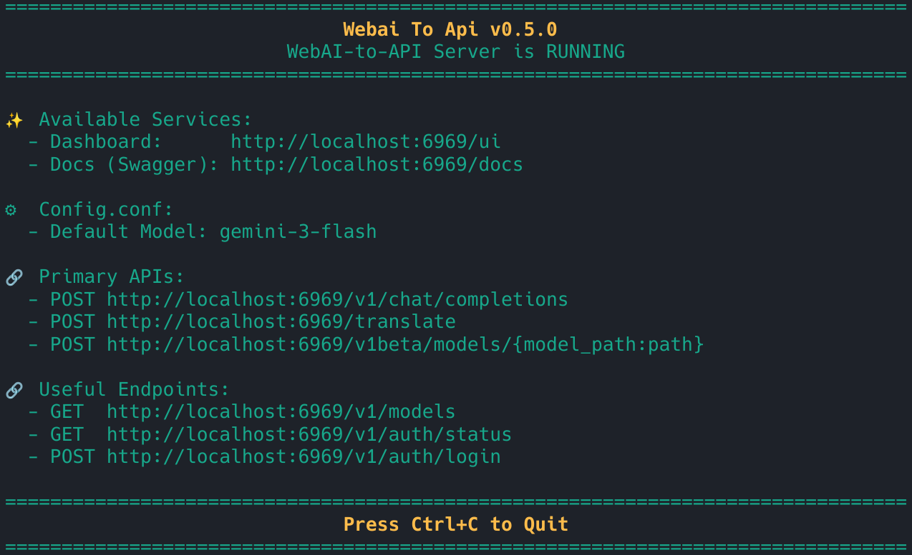
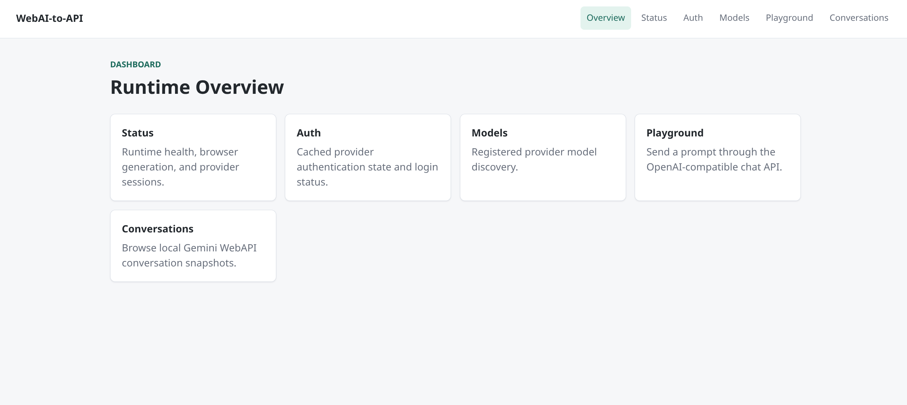

# WebAI-to-API

<p align="center">
  
  
</p>

**WebAI-to-API** is a browser-native AI runtime that exposes browser-based AI services through OpenAI-compatible APIs.

---

## Features

* OpenAI-compatible `/v1/chat/completions` API
* Provider-based architecture with unified routing
* Streaming response support (SSE)
* Conversation continuation support
* Health, readiness, and runtime diagnostics endpoints
* Docker deployment support
* Authentication management and browser login workflows

---

## Available Providers

### Gemini

Provides access to Google Gemini models through either the WebAPI backend or a browser-native Playwright runtime.

---

## Quick Start

**Prerequisites:** Git, Python `>=3.11,<3.13` and Poetry. On Windows, use Python `3.11.10+` or `3.12.4+` for secure Gemini WebAPI temporary-cookie-cache handling. See the [Installation Guide](docs/installation.md) for full installation and troubleshooting details.

### 1. Install and Set Up

Clone the repository, enter the project directory, then run the setup wrapper for your platform.

**Linux / macOS**

```bash
git clone https://github.com/Amm1rr/WebAI-to-API.git
cd WebAI-to-API
./install.sh
```

**Windows PowerShell**
```
git clone https://github.com/Amm1rr/WebAI-to-API.git
cd WebAI-to-API
.\install.ps1
```

The wrappers create missing configuration and runtime state, install project dependencies and Playwright Chromium, then run diagnostics. See the [Installation Guide](docs/installation.md) for manual setup, troubleshooting, and Make shortcuts.

### 2. Configure

Review the generated `config.conf`. Core Gemini settings include:

```ini
[Gemini]
backend = webapi
default_model = gemini-3-flash
extended_thinking = false
```

See the [Configuration Guide](docs/configuration.md) for provider, proxy, logging, and authentication settings.

### 3. Authenticate

For browser-based Gemini authentication:

```bash
poetry run python verify_login.py
```

Gemini WebAPI can also use configured cookies. See the [Configuration Guide](docs/configuration.md) for authentication methods. For Docker authentication, see the [Docker Deployment Guide](docs/docker.md).

### 4. Start the Server

```bash
poetry run python src/run.py
```

* API: `http://localhost:6969`
* Dashboard: `http://localhost:6969/ui`
* Swagger UI: `http://localhost:6969/docs`

---

## Updating

### Host

**Linux / macOS**
```bash
./update-linux-macos.sh
```

**Windows**
```cmd
update-windows.cmd
```

Updates are version-driven from `origin/master`. See the [Updater Guide](docs/updating.md) for locking, preflight checks, rollback, dependency sync, and platform details.

### Docker

```bash
git pull
APP_UID=$(id -u) APP_GID=$(id -g) docker compose up -d --build
```

See the [Docker Deployment Guide](docs/docker.md) for Docker setup and deployment details.

---

## Send Your First Request

```bash
curl -X POST http://localhost:6969/v1/chat/completions \
  -H "Content-Type: application/json" \
  -d '{
    "model": "gemini-3-flash",
    "messages": [
      {
        "role": "user",
        "content": "Hello!"
      }
    ]
  }'
```

---

## Dashboard

Open the dashboard at `http://localhost:6969/ui`. It provides runtime status, authentication view, model and API discovery, a playground, and conversation management where supported. See the [Dashboard Guide](docs/dashboard.md).

---

## Main Endpoints

| Endpoint | Purpose |
| --- | --- |
| `/v1/chat/completions` | Main OpenAI-compatible chat endpoint |
| `/v1/stateless/chat/completions` | Canonical client-owned-history Gemini WebAPI chat endpoint |
| `/v1/stateless/models` | Direct Gemini WebAPI models valid for stateless chat (including valid slash-containing IDs) |
| `/v1/temporary/chat/completions` | Deprecated temporary compatibility endpoint (delegates to stateless) |
| `/v1/models` | Current runtime model catalog |
| `/v1/conversations` | Manage persisted Gemini WebAPI conversations |
| `/v1/auth/status` | Authentication status |
| `/v1/auth/login` | Interactive browser login trigger |
| `/v1/runtime/status` | Runtime diagnostics |
| `/health` | Liveness |
| `/ready` | Runtime readiness |
| `/translate` | Translate It! compatibility endpoint |
| `/ui` | Dashboard |

See [API Documentation](docs/api.md) for the complete API surface, including compatibility and legacy endpoints.

---

## Hermes / Stateless API

Hermes Agent and other client-owned-history clients can use the canonical stateless endpoint:

```text
http://127.0.0.1:6969/v1/stateless
```

Append `/models` for discovery or `/chat/completions` for requests:

```text
GET  /models
POST /chat/completions
```

This surface uses direct Gemini WebAPI execution only (`temporary=True`, no `conversation_id`, no SQLite snapshots, client owns and resends all history). Slash-containing model IDs are valid when advertised by the Gemini WebAPI runtime catalog. Streaming and tool calling are supported. The legacy `/v1/temporary/chat/completions` endpoint remains as a deprecated compatibility wrapper that delegates to the same implementation. See the [API Documentation](docs/api.md#stateless-chat-api) and [Stateless Chat Contract](docs/specs/stateless-chat-contract.md).

---

## Supported Models and Routing

Available models depend on configured providers and runtime availability. Use `/v1/models` as the authoritative current catalog.

```text
gemini-3-flash
playwright/gemini-3-flash
```

Unprefixed Gemini models use the configured Gemini backend. `playwright/...` forces browser-native Gemini routing, while `atlas/...` routes to Atlas. See [API Documentation](docs/api.md) for full routing behavior.

---

## Configuration Summary

Configure Gemini backend selection (`webapi` or `playwright`), default model, provider enablement, proxy, logging, and Atlas API access in `config.conf` and `.env`. Set a default for Extended Thinking with `[Gemini].extended_thinking`, or override it per request with `provider_options.gemini.extended_thinking`. See the [Configuration Guide](docs/configuration.md).

---

## File Support

OpenAI-style file content parts are supported by Gemini WebAPI. Gemini Playwright and Atlas do not currently support file parts, and Gemini WebAPI does not preserve exact text/file interleaving. See [API Documentation](docs/api.md) for supported formats and limits.

---

## Security

WebAI-to-API does not provide caller API authentication. Keep the default localhost binding unless external authentication and access control protect the service. See the [Docker Deployment Guide](docs/docker.md) and [Dashboard Guide](docs/dashboard.md).

---

## Documentation

* [Installation Guide](docs/installation.md)
* [API Documentation](docs/api.md)
* [Configuration Guide](docs/configuration.md)
* [Architecture Guide](docs/architecture.md)
* [Docker Deployment Guide](docs/docker.md)
* [Dashboard Guide](docs/dashboard.md)
* [Updater Guide](docs/updating.md)

Interactive API documentation is available through Swagger UI when the server is running.

---

## Star History

[](https://star-history.dera.page/#Amm1rr/WebAI-to-API&Date)

---

## License

WebAI-to-API is licensed under the MIT License. See [LICENSE](LICENSE) for the full text.


<br>

[](https://github.com/Amm1rr/)
