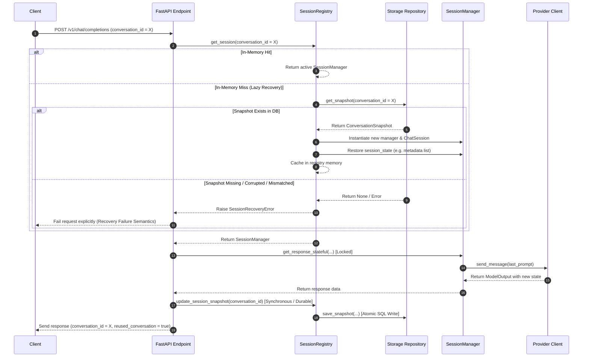

## Context

### Current Architecture Assessment
The existing runtime architecture implements stateful conversation continuity inside the memory-resident `SessionRegistry`. The current component lifecycle operates as follows:
- **SessionRegistry**: A global, in-memory container that manages active `SessionManager` instances. It maps API-facing cryptographically secure opaque tokens (`conversation_id`) to the respective manager.
- **SessionManager**: A request-scoped serialization container. It maintains the active `ChatSession` (the provider session instance), manages a synchronization lock (`self.lock`), tracks concurrent streaming tasks via `self.active_streams`, and registers the last accessed timestamp (`self.last_accessed`).
- **Streaming Interactions**: Stateful completions and streaming requests (`get_response_stateful`, `get_streaming_response_stateful`) acquire the manager's lock for the duration of the API call to serialize client requests.
- **Recovery & Bootstrapping**: On the first turn of a new session, the provider concatenates all prior historical messages to bootstrap the conversation context on Google's servers. With the persistent conversation layer, this history concatenation fallback path is strictly deprecated for existing sessions; recovery of a previously persisted session ID must follow a strict fail-closed model, failing explicitly if recovery cannot be completed safely.
- **Areas Impacted by Persistence**: Adding a persistent layer alters the lookup-or-create workflow in `SessionRegistry`. The registry becomes the orchestrator of persistent state loading and saving via a storage repository, completely decoupling the execution-only `SessionManager` from database concerns.

---

## Goals / Non-Goals

**Goals:**
- **Restart-Safe Continuity**: Enable complete recovery of active conversation contexts across process restarts without relying on message history concatenation.
- **Provider-Agnostic Portability**: Define an absolute separation between generic conversation snapshots and provider-specific internal states, allowing future support for additional providers (e.g., Claude, ChatGPT, Playwright-backed, or key-based APIs) without database schema modifications.
- **Fail-Closed Reliability**: Ensure that any failure during conversation recovery results in explicit error escalation rather than silent thread creation or unintended history concatenation.
- **Full Backward Compatibility**: Maintain the existing API request/response interface and concurrency model.
- **Capability-Driven Integration**: Decouple the core registry from hardcoded provider branches by introducing a scalable capability container contract in provider adapters.
- **State Schema Resiliency**: Introduce provider-level versioning within the opaque state to ensure robust migration paths as provider formats evolve over time.
- **Storage Extensibility**: Build an abstract repository interface that runs on SQLite for the MVP, but can be seamlessly migrated to PostgreSQL in production environments.

**Non-Goals:**
- **No Full History Duplication**: The system will not act as a primary database for full chat logs or conversation history. Google/Gemini remains the single source of truth for the message content; only lightweight session snapshots are persisted.
- **Redis Integration**: Distributed caching or Redis-based lock managers are out of scope for the MVP.
- **Multi-Server State Replication**: Real-time cross-process state sync or distributed event-bus systems are out of scope.

---

## Decisions

### Decision 1: Persistence Architecture & Boundaries
We introduce a dedicated persistent layer with a repository pattern. The architectural boundaries and responsibility limits are defined as follows:
- **ConversationSnapshot**: The storage-level data model representing a conversation's state.
- **SessionRegistry**: Authoritative orchestrator for both in-memory lifecycle and persistent state synchronization. It handles lazy loading of snapshots, creation/restoration of `SessionManager` instances, and coordinates synchronous, durable updates to the `RepositoryLayer` upon successful request completion.
- **SessionManager**: Completely persistence-ignorant. It serves solely as a request execution coordinator, lock owner, and active stream tracker. It has zero knowledge of repositories, storage, or database snapshots.
- **RepositoryLayer**: Responsible exclusively for database CRUD mapping, transactions, and storage abstraction (`IConversationRepository` interface).

---

### Decision 2: Provider-Agnostic Session Model
To prevent provider-specific leakage into the core database layer, the design utilizes the **Strategy and Adapter patterns**:
- **Abstract Provider Session State**: Define a base interface `ProviderSessionState` which providers must subclass to encapsulate their specific connection details.
- **Serialized State Payload**: The storage layer treats the provider-specific state as an opaque, JSON-serialized string.
- **Provider Adapters**: Each provider implements a parser/serializer that serializes their active session (e.g., `ChatSession`) into a JSON dictionary and conversely reconstructs the session object from a restored JSON dictionary. All provider-specific fields (such as Gemini's metadata, rid, gem_id, and provider-specific account identity hashes) are strictly encapsulated inside this payload.

---

### Decision 3: Storage Layer Design
To isolate the database engine, the persistence layer implements the **Repository Pattern**:
- **`IConversationRepository` (Interface)**: Defines abstract methods for `get_snapshot(conversation_id)`, `save_snapshot(snapshot)`, and `delete_snapshot(conversation_id)`.
- **`SQLiteConversationRepository` (Implementation)**: Uses SQLAlchemy or raw Python `sqlite3` to perform atomic queries against a local SQLite file.
- **PostgreSQL Migration Path**: Moving to PostgreSQL simply requires writing a `PostgreSqlConversationRepository` implementing the same interface and swapping the repository binding at startup via dependency injection.

---

### Decision 4: Snapshot Schema
The database table `conversation_snapshots` utilizes a strictly provider-agnostic, minimalist schema. Generic database columns are stripped of all provider-specific concepts (such as `provider_identity`, `model_name`, GAIA IDs, or active Gem identifiers):

| Field Name | Type | Constraints | Description |
| :--- | :--- | :--- | :--- |
| `conversation_id` | `VARCHAR(64)` | `PRIMARY KEY` | Opaque token generated via `secrets.token_urlsafe(16)`. |
| `provider_name` | `VARCHAR(32)` | `NOT NULL` | Identifier of the provider (e.g., `"gemini"`). |
| `session_state` | `TEXT` | `NOT NULL` | Opaque JSON string containing provider-specific variables. |
| `schema_version` | `INT` | `NOT NULL` | Version integer to support schema migrations. |
| `updated_at` | `TIMESTAMP` | `NOT NULL` | Last write timestamp. |

#### Gemini-Specific `session_state` Mapping:
For the Gemini provider, the `session_state` JSON payload encapsulates the metadata list, gem identifier, model name, and provider state versioning:
```json
{
  "provider_state_version": 1,
  "metadata": ["cid", "rid", "rcid", null, null, null, null, null, null, "context_str"],
  "gem_id": "gem_id_or_null",
  "model_name": "model_id_string"
}
```

---

### Decision 5: Recovery Lifecycle & Fail-Closed Model
The system implements a lazy-restoration, fail-closed recovery lifecycle. If any error or validation mismatch occurs during recovery, the request is rejected with a corresponding `SessionRecoveryError`. The system will never silently fall back to history concatenation or create a new blank conversation for an existing conversation ID.



#### Encapsulated Recovery Validation Hook & Recovery Error Categories:
To prevent architectural drift and maintain structural integrity, the core layer defines a single recovery validation contract with a strict operational boundary:

##### `BaseProviderAdapter.validate_session_recovery(session_state, client_context)`
* **Operational Boundary**: MUST operate exclusively on persisted snapshot state during lazy database restoration.
* **Responsibilities**: MUST perform persisted snapshot schema validation, state integrity verification, `provider_state_version` validation, and provider-specific restoration safety checks.
* **Constraints**: MUST NOT validate active cached sessions or perform cache-hit ownership checks.

- **Recovery Error Categories**:
  1. **`SnapshotNotFoundError`**: The requested `conversation_id` is missing from the database.
  2. **`StateIntegrityError`**: The JSON payload in `session_state` is corrupted, fails version validation, or lacks mandatory provider state fields.
  3. **`ProviderThreadExpiredError`**: The remote provider's backend (e.g., Google) reports that the thread has been expired or deleted.

#### Decoupled Persistence Trigger & Design Note:
The persistence trigger policy is intentionally decoupled from the storage layer, snapshot schemas, and conversation recovery interfaces:
* **MVP Trigger Policy**: The MVP adopts a completion-time durability strategy, persisting snapshots synchronously only after successful request or stream completions.
* **Trigger Policy Decoupling Note**: By keeping persistence triggering decoupled from the provider's generation execution logic and database schemas, alternative trigger policies (e.g. streaming-time checkpoints, background async flushing, or incremental snapshot updates) can be introduced in the future without modifying core snapshot tables, repository APIs, or recovery lifecycle interfaces.

#### Decoupled Model Verification Policy:
Model configuration is treated as diagnostic metadata inside the opaque `session_state` payload.
* The generic persistence layer does not perform model consistency checks.
* If a client resumes an existing `conversation_id` under a different model, the system SHALL allow the recovery to proceed, letting the provider adapter handle model-switching logic internally without failing recovery.

---

### Decision 6: Persistence Write Strategy
- **Synchronous Durable Writes**: To prevent context split / split-brain state divergence, all database snapshot updates MUST be synchronous and durable before returning the response to the client.
- **Crash-Consistency and State Divergence Justification**: If an asynchronous/background write model is used, there is a risk that the API returns a success response to the client, but the application process crashes or loses power before the background write is flushed to disk. In this scenario, the remote provider (Google) has successfully appended the new turn to the conversation context, but the local database still points to the previous turn. Upon the next client request, the reattached session will load stale metadata, leading to a context split divergence on the provider's backend.
- **SQLite WAL Mode Rationale**: Under SQLite's Write-Ahead Logging (WAL) mode, a synchronous write transaction is extremely fast (typically <5-15ms). The tiny performance overhead is a necessary and highly acceptable trade-off for absolute crash-consistency and state alignment.

---

### Decision 7: Provider Capability Contract
To prevent hardcoded provider branching checks (such as `if provider == "gemini"`) from contaminating the core `SessionRegistry` while avoiding boolean property proliferation as new providers are added, adapters declare their capabilities through a standard **Capability Container Model**:
- **`ProviderCapability` (Enum)**: Defines standard capability tokens representing the supported features of the persistence lifecycle:
  * `ProviderCapability.PERSISTENT_RECOVERY`: Represents the capability to reattach to conversations using saved session state.
- **`capabilities` Property**: Every provider adapter exposes a `capabilities: set[ProviderCapability]` attribute representing its supported feature set.
- **Dynamic Registry Orchestration**: The `SessionRegistry` evaluates capabilities dynamically (e.g. `if ProviderCapability.PERSISTENT_RECOVERY in adapter.capabilities`) to orchestrate restoration flows, ensuring full portability without hardcoded provider conditionals.

---

### Decision 8: Provider Session State Versioning
To handle evolutionary schema updates in provider formats, the opaque `session_state` payload utilizes a dedicated version identifier:
- **`provider_state_version`**: An integer key stored inside the `session_state` JSON object, independent of the generic schema version.
- **Validation and Migration**: The provider adapter is responsible for evaluating `provider_state_version` during the `validate_session_recovery` phase.
  * The adapter may parse and run local migration functions to automatically upgrade older formats to the current state version.
  * If a version is completely unsupported, corrupted, or incompatible, the recovery MUST fail closed and raise a `StateIntegrityError`.

---

## Risks / Trade-offs

### 1. Failure Mode Analysis

| Failure Case | Detection | Expected Behavior | Recovery Strategy | User Impact |
| :--- | :--- | :--- | :--- | :--- |
| **Missing Snapshot** | DB query returns `None`. | Fail explicitly. | Raise `SnapshotNotFoundError`. Prevent silent fallback. | High. Request fails; client must choose whether to start a new chat. |
| **Corrupted Snapshot** | JSON parsing error or missing schema keys. | Fail explicitly. | Raise `StateIntegrityError` and abort request. | High. Request is rejected; user must start a new conversation. |
| **Expired Upstream Conversation** | Google API returns 404/Not Found for the `cid`. | Fail explicitly. | Catch error, delete stale snapshot, raise `ProviderThreadExpiredError`. | High. Thread is permanently expired on backend; user must start new conversation. |
| **Concurrent Recovery** | Lock contention on registry miss. | Serialization. | Registry-level `_lock` serializes creation; subsequent concurrent requests hit the memory cache. | Low. Minor latency increase for the concurrent request. |

---

### 2. Security Model
- **Access Control Validation**: The cryptographically secure opaque `conversation_id` serves as a secure token. Snapshot lookups require presenting the exact token to authorize restoration.
- **Sensitive Data Handling**: The persisted `session_state` contains only structural metadata (`cid`, `rid`, `context_str`, `gem_id`) and does not store plaintext message contents or prompts, significantly shrinking the local storage attack surface.

---

### 3. DEFAULT_METADATA Shared-Reference Mitigation
To prevent memory corruption and context bleed caused by the shared-reference mutation bug in `gemini-webapi`'s `DEFAULT_METADATA` constant:
- **Mitigation Invariant**: During session lazy-loading recovery or initialization, the provider adapter MUST break any shared reference to the global `gemini_webapi.constants.DEFAULT_METADATA` list before any prompt is executed or generation occurs.
- **Reference Isolation Invariant**: The restored metadata array MUST be isolated into session-local state. While the current Gemini implementation accomplishes this by copy-assigning to the private attribute (e.g. `session._ChatSession__metadata = list(restored_metadata)`), other mechanisms or future provider adapters may use alternative isolation techniques as long as the behavioral invariant of preventing global `DEFAULT_METADATA` mutation is strictly preserved.

---

### 4. Operational Model & Scalability
- **TTL & Pruning**: The registry maintains an active memory cache with a capacity of `MAX_SESSIONS = 500`. Stale in-memory sessions are passively pruned if idle for more than 60 minutes.
- **DB Pruning**: A daily background pruning task deletes inactive snapshots based on a configurable `RETENTION_PERIOD_DAYS` parameter (defaulting to 90 days of inactivity, i.e., `updated_at < NOW - RETENTION_PERIOD_DAYS`), preventing database bloat and respecting data retention compliance.
- **Multi-Worker Scaling**: SQLite with `journal_mode=WAL` (Write-Ahead Logging) is sufficient and highly reliable for single-node multi-worker deployments.
